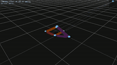
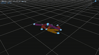
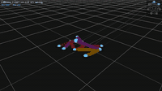

# smeagol

> The name is a faulty homonym — *Sméagol* (Gollum, Lord of the Rings) sounds like *Golem*.

An attempted recreation of **The Golem Project — Automatic Design and Manufacture of Robotic Lifeforms** by Hod Lipson and Jordan B. Pollack, CS Dept., Brandeis University.

- Project page: http://demo.cs.brandeis.edu/golem/
- Paper: H. Lipson and J. B. Pollack (2000), "Automatic design and Manufacture of Robotic Lifeforms", *Nature* 406, pp. 974–978.

---

Robots are simulated as spring-mass trusses evolved by a genetic algorithm. Fitness is measured by horizontal displacement. The examples below show the best robot at three points during one run (eval 5708 → 7439 → 65713).

| eval 5708 | eval 7439 | eval 65713 |
|:---------:|:---------:|:----------:|
|  |  |  |

---

## Quick start

```bash
mkdir build && cd build
cmake .. && make -j$(nproc)
cd ../prod
bash run.sh
```

Requires: C++17, CMake, Eigen3, Raylib, yaml-cpp, ffmpeg.

## Documentation

Hosted at **https://DanielMarchand.github.io/smeagol/** — rebuilt automatically on every push to `main`.

To build locally:
```bash
make docs          # from inside build/
# open docs/doxygen/html/index.html
```

Requires Doxygen (`apt install doxygen`).
