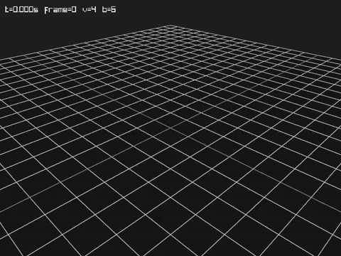
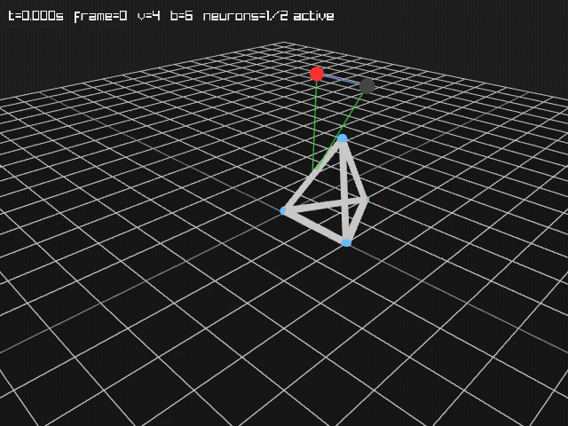

# Smeagol

A C++17 replication of the evolutionary robotics experiment described in:

> Lipson, H. & Pollack, J.B. (2000). *Automatic design and manufacture of robotic lifeforms.* Nature, 406, 974–978.

The system evolves 3D truss structures and their neural controllers simultaneously, selecting for locomotion distance across an infinite flat plane.

---

## Architecture

The codebase has four layers: **data**, **physics**, **rendering**, and (planned) **evolution**.

### Data — `Robot` and `RobotPart`

All physical and neural components inherit from `RobotPart`. The four concrete types are:

| Class | Role | Key fields |
|---|---|---|
| `Vertex` | Ball joint in 3D space | `Eigen::Vector3d pos` |
| `Bar` | Elastic rod connecting two vertices | `v1`, `v2`, `rest_length`, `radius` |
| `Neuron` | Discrete threshold node | `threshold`, `synapse_weights` |
| `Actuator` | Maps neuron output to a bar's rest length | `bar_idx`, `neuron_idx`, `bar_range` |

`Robot` is the container: it holds `std::vector`s of each type and provides `toYAML()` / `fromYAML()` for serialisation. Bar rest lengths are computed automatically from the initial vertex positions at load time, so a robot is always stress-free at $t = 0$. Bar stiffness is derived from material constants on demand:

$$k_i = \frac{E \cdot A_i}{L_{0,i}}$$

where $A_i = \pi r_i^2$, $E = 0.896\ \text{GPa}$, and $L_{0,i}$ is the rest length.

### Physics — `Simulator`

`Simulator` takes ownership of a robot's geometry (copied into an $N \times 3$ Eigen matrix) and implements quasi-static energy minimisation. This is the same approach used by Lipson & Pollack — there is no velocity or momentum; the system always seeks the nearest energy minimum from its current configuration.

#### Energy function

The total potential energy is the sum of three terms:

$$H = \underbrace{\sum_i k_i \delta_i^2}_{H_{\text{elastic}}} + \underbrace{\sum_j m_j g z_j}_{H_{\text{gravity}}} + \underbrace{\sum_j k_{\text{floor}} \min(z_j, 0)^2}_{H_{\text{floor}}}$$

- $\delta_i = \|p_{v_2} - p_{v_1}\| - L_{0,i}$ is the extension of bar $i$.
- Vertex masses $m_j$ are computed by lumping each bar's mass ($\rho A L_0$) equally onto its two endpoints.
- $k_{\text{floor}} = 1.4 \times 10^6\ \text{N/m}$ (matched to a typical bar stiffness). The floor is intentionally soft — the robot penetrates slightly, but the gradient always pushes it back up.

#### Gradient descent (`relax`)

At each step the gradient $\nabla H$ is computed analytically:

$$\frac{\partial H_{\text{elastic}}}{\partial \mathbf{p}_{v}} = \sum_{i \ni v} \pm \frac{2 k_i \delta_i}{\|\Delta \mathbf{p}_i\|} \Delta \mathbf{p}_i$$

$$\frac{\partial H_{\text{gravity}}}{\partial z_j} = m_j g \qquad \frac{\partial H_{\text{floor}}}{\partial z_j} = 2 k_{\text{floor}} z_j \quad (z_j < 0)$$

Positions are updated by:

$$\mathbf{p} \leftarrow \mathbf{p} - D_s \nabla H$$

where $D_s$ is the step size. A small uniform noise term can be added each step to escape unstable saddle points. The loop terminates when $\|\nabla H\|_F < \epsilon$ or a maximum iteration count is reached.

#### Friction (`applyFriction`)

Before each gradient step, lateral ($x$,$y$) gradient components are zeroed for any vertex in contact with the floor whose static friction threshold has not been exceeded:

$$|\nabla_{xy} H_j| \leq \mu_s \cdot N_j, \quad N_j = 2 k_{\text{floor}} |z_j|$$

$\mu_s = 0.5$ (Coulomb static friction coefficient).

#### Neural tick and actuation

At each frame, before `relax` is called, the neural network is stepped once and its outputs are applied to bar rest lengths.

Each `Neuron` is a discrete threshold unit. All neurons update **in parallel** (synchronous update — each neuron reads the *previous* activations of all its inputs):

$$a_i^{(t+1)} = \begin{cases} 1 & \text{if } \sum_j w_{ij}\, a_j^{(t)} \geq \theta_i \\ 0 & \text{otherwise} \end{cases}$$

Each `Actuator` then maps its neuron's binary output to a signed change in a bar's rest length:

$$L_{0,i}^{(t+1)} = L_{0,i}^{(t)} + a_k^{(t+1)} \cdot r_i$$

where $r_i$ is `bar_range` (metres, signed). When the neuron fires the bar stretches or compresses by $|r_i|$; when silent the rest length is unchanged. Actuation is clamped so no single step moves a rest length by more than 1 cm.

### Rendering — `SceneRenderer` hierarchy

All rendering shares a single base class to guarantee consistent camera, lighting, and floor across tools.

```
SceneRenderer          ← orbital camera, drawRobot(), drawFloor(), drawNeuralOverlay()
├── SnapshotRenderer   ← renders one frame → PNG, closes
└── VideoRenderer      ← keeps window open; addFrame() → numbered PNGs
                         finish() → ffmpeg → MP4, cleans up temp dir
```

`VideoRenderer` uses an off-screen Raylib context (no visible window). Each call to `addFrame(robot, sim_time, activations)` runs one full render pass and writes `frame_XXXX.png` to a unique temporary directory. `finish(output_path)` invokes:

```
ffmpeg -y -framerate <fps> -i <tmp>/frame_%04d.png -c:v libx264 -pix_fmt yuv420p <output>
```

The neural overlay colours neurons **red** when firing and grey when silent, synapse lines **blue** (excitatory) or **red** (inhibitory), and actuator connections **green**.

Coordinate system: the physics simulation uses **Z-up**; `SceneRenderer::toRaylib()` remaps to Raylib's **Y-up** convention before any draw calls.

### Fitness Wrapper — `FitnessEvaluator`

Wraps the simulation loop into a single callable that maps a `Robot` to a scalar locomotion score.

```cpp
FitnessEvaluator eval;          // default: 12 cycles × 5 000 steps at Ds = 1e-7
double score = eval.evaluate(robot);
```

**Algorithm** — for a robot with $N_c$ cycles and $S$ steps per cycle:

1. Construct a fresh `Simulator` from the robot (no inherited state).
2. Record the initial mass-weighted XY centre-of-mass $\mathbf{p}_0$.
3. For each cycle $c = 1 \ldots N_c$:
   - `tickNeural()` — advance the recurrent network one discrete step.
   - `applyActuators()` — update bar rest lengths from neuron outputs.
   - `relax(S, D_s, 0, 0)` — $S$ gradient steps (no noise, zero tolerance so all steps run).
4. Record final CoM $\mathbf{p}_f$ and return $\|\mathbf{p}_f - \mathbf{p}_0\|_{xy}$ (metres).

An optional `trajectory` pointer collects the CoM at every cycle boundary for plotting.

`FitnessParams` exposes the three knobs:

| Field | Default | Meaning |
|---|---|---|
| `cycles` | 12 | evaluation length (neural cycles) |
| `steps_per_cycle` | 5 000 | gradient-descent steps per cycle |
| `step_size` | 1e-7 | $D_s$ — must satisfy $D_s < 1/(2k)$ for stability |

---

## Material constants

All values follow Lipson & Pollack (2000), defined in `include/Materials.h`:

| Constant | Value | Description |
|---|---|---|
| $E$ | $0.896\ \text{GPa}$ | Young's modulus |
| $\rho$ | $1000\ \text{kg/m}^3$ | Mass density |
| $S_{\text{yield}}$ | $19\ \text{MPa}$ | Yield strength (used for validation) |
| $g$ | $9.81\ \text{m/s}^2$ | Gravitational acceleration |
| $k_{\text{floor}}$ | $1.4 \times 10^6\ \text{N/m}$ | Floor penalty stiffness |
| $\mu_s$ | $0.5$ | Static friction coefficient |

---

## Requirements

- **CMake** ≥ 3.16
- **C++17** compiler (GCC ≥ 9, Clang ≥ 10)
- **Eigen3** ≥ 3.3 — header-only linear algebra (`find_package(Eigen3)`)
- **yaml-cpp** — YAML serialisation (`find_package(yaml-cpp)`)
- **Raylib** ≥ 4.0 — 3D rendering (`find_package(raylib)`)
- **FFmpeg** — MP4 compilation (must be on `PATH` at runtime; only needed for `VideoRenderer::finish()`)
- A display server (X11 or Wayland) for any tool that opens a window. On headless machines use `Xvfb`:
  ```
  Xvfb :99 -screen 0 1280x720x24 &
  export DISPLAY=:99
  ```

---

## Build

```bash
cmake -B build
cmake --build build -j$(nproc)
ctest --test-dir build --output-on-failure
```

---

## Tools

| Binary | Purpose |
|---|---|
| `validate_robot` | Loads a YAML robot and prints validation errors |
| `visualize_robot` | Interactive 3D viewer (orbital camera) |
| `snapshot_robot` | Renders a single PNG from a YAML robot |
| `deformation_series` | Displaces one vertex incrementally; prints energy table + PNG per step |
| `run_simulation` | Runs quasi-static simulation from YAML and produces an MP4 |
| `evaluate_fitness` | Evaluates a robot's locomotion fitness and optionally records a video |

### `evaluate_fitness`

```bash
evaluate_fitness <robot.yaml> [params.yaml] [--video]
```

Runs the [Fitness Wrapper](#fitness-wrapper--fitnessevaluator) over `N` neural cycles, prints a per-cycle CoM trajectory table, and reports the final XY displacement fitness score. Passing `--video` (or setting `output` in `params.yaml`) records an MP4 of the evaluation replay.

`params.yaml` controls the evaluation:

```yaml
cycles:          12       # number of neural cycles
steps_per_cycle: 5000    # gradient-descent steps per cycle
step_size:       1.0e-7  # D_s
fps:             10
width:           640
height:          480
output:          /tmp/fitness_eval.mp4
```

---

### `run_simulation`

```bash
run_simulation <robot.yaml> <simulation.yaml>
```

`simulation.yaml` controls all physics and output parameters:

```yaml
fps:             30
num_frames:      200
steps_per_frame: 5000    # gradient steps between captured frames
step_size:       1.0e-7  # D_s; must be < 1/(2k) for stability
width:           640
height:          480
output:          /tmp/out.mp4
```

---

## Examples

| Directory | What it shows |
|---|---|
| `examples/robot_visualize/` | Interactive view + single snapshot of a robot |
| `examples/deformation_series/` | Energy sanity-check: elastic energy rises from ~0 as a vertex is displaced |
| `examples/robot_fall/` | Physics validation: inverted tetrahedron falls and tips under gravity |
| `examples/robot_sineactuator/` | Actuator validation: bar length driven by a `sin(ωt)` debug waveform |
| `examples/robot_neuralactuator/` | Neural actuation: 2-neuron anti-phase oscillator drives a strut bar ±1 cm per tick |
| `examples/robot_fitness/` | Fitness evaluation: always-firing neuron elongates a strut, producing measurable XY locomotion |

---

### `robot_fall` — physics validation



An inverted tetrahedron placed above the floor with its apex slightly off-centre. At $t=0$ the structure is stress-free ($H_\text{elastic} = 0$) because rest lengths are auto-computed from the initial vertex positions (see [Data](#data--robot-and-robotpart)). The only driving force is gravity.

The animation exercises the three-term energy function and gradient descent loop described in [Physics — Simulator](#physics--simulator):

1. **Free fall** — all vertices descend together; $H_\text{gravity}$ falls monotonically, $H_\text{elastic} \approx 0$ because no bar is stretched.
2. **Floor contact** — the apex enters the penalty region ($z < 0$); $H_\text{floor}$ pushes it back. The floor is soft ($k_\text{floor} \approx k_\text{bar}$) so slight penetration occurs.
3. **Tip-over** — the apex is off-centre from the base centroid, so the floor reaction creates a net torque. Gradient descent finds the lower-energy lying-flat configuration and the structure rotates toward it.
4. **Settling** — all vertices reach near-floor altitude; elastic energy stays negligible throughout.

> There is no velocity or momentum. Each frame is exactly `steps_per_frame` gradient steps of size $D_s$, tracing the steepest-descent path through configuration space.

---

### `robot_neuralactuator` — neural actuation



The same tetrahedron geometry, resting on the floor and controlled by a two-neuron recurrent network. Each frame the network is ticked once and its outputs are applied to bar rest lengths before `relax` runs (see [Neural tick and actuation](#neural-tick-and-actuation)).

**Network topology — cross-coupled anti-phase oscillator:**

```
Neuron 0 ──w=1──► Neuron 1
Neuron 1 ──w=1──► Neuron 0
         threshold = 0.5 (both)
```

No self-weights. Neuron 0 is primed ($a_0 = 1$) at $t = 0$; neuron 1 starts silent. Because each neuron fires only when its partner was active last tick, they alternate with period 2:

| Tick | $a_0$ | $a_1$ |
|------|--------|--------|
| 0    | 1      | 0      |
| 1    | 0      | 1      |
| 2    | 1      | 0      |
| …    | …      | …      |

**Actuators** — both wired to the same bar (left strut, bar 3):

| Actuator | Neuron | `bar_range` | Effect when neuron fires |
|---|---|---|---|
| 0 | 0 | +0.010 m | strut **lengthens** by 1 cm |
| 1 | 1 | −0.010 m | strut **shortens** by 1 cm |

The opposing signs mean the strut oscillates ±1 cm around its natural length with no cumulative drift. The quasi-static physics engine responds by rocking the apex back and forth every cycle, visible in the animation above.

The neural overlay shows neurons **red** (firing) or grey (silent), synapse lines blue/red by sign, and green lines connecting each neuron to its actuated bar.

---

### `robot_fitness` — fitness evaluation

A minimal robot with a single always-firing neuron (self-excitatory, $w_{00} = 1$, threshold $= 0.5$) wired to one actuator that elongates bar 3 by 5 mm every cycle. This creates cumulative asymmetric deformation that shifts the CoM across the floor over 12 cycles.

Running `examples/robot_fitness/run.sh` prints a CoM trajectory and calls `evaluate_fitness` with `--video` to produce `/tmp/fitness_eval.mp4`:

```
Cycle   0:  x= 0.100000  y= 0.074162
Cycle   1:  x= 0.100235  y= 0.074412
...
Cycle  12:  x= 0.102825  y= 0.077449

Fitness (XY displacement): 0.004334 m
```

This confirms the fitness wrapper returns a positive, monotonically-growing signal for a locomoting robot and near-zero for a passive one (see [Fitness Wrapper](#fitness-wrapper--fitnessevaluator)).

---

## Evolutionary Algorithm

The steady-state loop lives in `src/Evolver.cpp` and is driven by `EvolverParams` loaded from a YAML config file.

### Loop structure

Each evaluation:

1. **Select a parent** from the population (fitness-weighted, see below).
2. **Clone + mutate** the parent.
3. **Evaluate fitness** of the child (re-simulate from scratch).
4. **Select a replacement slot** in the population (uniform or worst, see below).
5. **Overwrite** that slot with the child and archive the child as `robots/robot_<id>.yaml`.

Multiple children are evaluated in parallel using a rolling flight-window of `W = hardware_threads - 1` concurrent futures. The manager always keeps the window full.

---

### Parent selection

Three schemes are available, all controlled by a single `pressure` knob:

#### `proportionate` (classical roulette wheel)

Each individual's probability of being chosen as a parent equals:

$$P_i = \frac{f_i^p}{\sum_j f_j^p}$$

where $f_i$ is its fitness and $p$ is `pressure`.

| `pressure` | effect |
|---|---|
| `1.0` | linear roulette — original Lipson & Pollack. An individual twice as fit is twice as likely to be chosen. |
| `2.0` | quadratic — squares the fitness gaps. An individual twice as fit is **four times** as likely. |
| `4.0` | aggressive — fourth-power amplification. |
| `0.0` | degenerate uniform random — all individuals equally likely. |

**Weakness**: completely dependent on the absolute scale of fitness values. If all robots score between `0.1 m` and `0.12 m`, the ratios $f_i^p / \sum f_j^p$ are nearly identical no matter how large $p$ is — pressure is effectively zero once the population starts converging.

#### `tournament`

Sample `pressure` individuals uniformly at random (without replacement) and return the one with the highest fitness. `pressure` is cast to an integer ≥ 2.

| `pressure` | effect |
|---|---|
| `2` | weak — 50% chance of picking the better of two random individuals |
| `5` | moderate — best of 5 is almost always in the top 30% |
| `10` | strong — best of 10 is almost always in the top 10% |
| `20` | very aggressive — best of 20 is almost certain to be in the top few % |

**Strength**: completely insensitive to fitness scale. Whether robots score `0.001 m` or `100 m`, the selective advantage is the same. Strongly recommended over `proportionate` once the population has non-trivial structure.

#### `rank` (linear rank selection)

Sort the population by fitness (rank 1 = worst, rank $N$ = best). Assign weights by rank, not raw fitness:

$$P_i = \frac{2 - \eta_{\max}}{N} + \frac{2(\eta_{\max} - 1) \cdot \text{rank}_i}{N(N-1)}$$

where $\eta_{\max}$ is `pressure` ∈ [1.0, 2.0].

| `pressure` | effect |
|---|---|
| `1.0` | uniform — all individuals equally likely |
| `1.5` | moderate — best individual gets 3× the average selection rate |
| `2.0` | maximum — best gets exactly $2/N$ share; worst gets $0$ |

**Strength**: like tournament, insensitive to fitness scale. Unlike tournament, the probability distribution is smooth and deterministic given the fitness ranking. **Weakness**: caps at `pressure=2.0`; cannot be made more aggressive than that — use tournament if you need stronger pressure.

---

### Replacement

Controls which population slot the child overwrites.

#### `uniform_random` (default, Lipson & Pollack original)

The replacement slot is chosen uniformly at random over all `population_size` slots, including the current best. Over time this means any robot — including excellent ones — can be evicted. In combination with weak selection pressure, the population effectively random-walks unless the fitness landscape is very favourable.

#### `worst`

Always overwrites the slot with the *lowest* current fitness. The minimum fitness in the population is therefore **monotonically non-decreasing** — the worst individual can only get better or stay the same. Combined with strong selection pressure (`tournament` with a large size, or `rank` at `pressure=2.0`), this is the most aggressive setting available.

---

### Mutation operators

Five operators apply independently each eval, each with its own firing probability:

| Operator | `p_*` default | What it does |
|---|---|---|
| `perturbElement` | 0.10 | nudge a random bar's rest length by ±`perturb_bar_frac`; or nudge a random neuron's threshold or synapse weight |
| `addRemoveElement` | 0.01 | add or remove one bar (Strategy A: new vertex + bar; Strategy B: edge between two existing vertices) or one neuron |
| `splitElement` | 0.03 | split a random vertex into two (connected by a tiny bar) or bisect a bar at its midpoint |
| `attachDetach` | 0.03 | flip a random bar between structural and actuated (or back) |
| `rewireNeuron` | 0.03 | reassign a random actuator's bar target or neural source |

If **none** of the five operators fires naturally in a given step, one is forced at random to guarantee the child differs from its parent. High `forced` counts in the report indicate most parents are too structurally simple for the operators to find anything to act on — a normal early-run condition.

`max_rerolls` (default 100) is the retry limit when a mutated child fails `robot.isValid()`. On the final retry the evolver accepts an unmutated clone instead.

---

---

### Parallel evaluation

#### The rolling flight window

There are two kinds of threads: one **manager** thread that runs the evolutionary loop, and `W = hardware_threads - 1` **worker** threads that each run one fitness evaluation at a time.

The manager keeps a vector of in-flight futures — one per worker. Whenever a worker finishes and its slot is freed, the manager immediately submits a new child to fill it. This keeps all workers busy as long as there is work to do.

#### `waitForAny` — how the manager picks the next result

The naive approach is to always wait for the oldest in-flight job first. The problem: if that job happens to be a slow robot, every other worker finishes and sits idle while the manager is stuck blocking on that one future.

The fix is `waitForAny`. Instead of blocking on a specific future, it scans all in-flight futures and returns the index of whichever one finishes first:

```cpp
static int waitForAny(std::vector<EvalFuture>& jobs)
{
    const auto no_wait    = std::chrono::microseconds(0);
    const auto poll_sleep = std::chrono::microseconds(200);

    while (true) {
        for (int i = 0; i < (int)jobs.size(); ++i) {
            if (jobs[i].wait_for(no_wait) == std::future_status::ready)
                return i;
        }
        std::this_thread::sleep_for(poll_sleep);
    }
}
```

Step by step:

1. `wait_for(0µs)` probes one future **without blocking**. It returns instantly with either `ready` (the worker is done) or `timeout` (still running).
2. The loop scans every in-flight job in zero wall time looking for the first `ready` one.
3. If none are ready yet, the manager sleeps for 200 µs before scanning again. This prevents the manager from spinning and wasting a core.
4. The moment any worker finishes, `waitForAny` returns its index. The manager calls `.get()` on that specific future to retrieve the result, then submits a new job into that slot.

#### The `isNonMover` fast path

Most robots early in a run have no actuators or no neurons — they are structurally inert and will score exactly 0.0 regardless of how long the simulator runs. `Robot::isNonMover()` catches both cases:

```cpp
[[nodiscard]] bool isNonMover() const
{
    return actuators.empty() || neurons.empty();
}
```

`FitnessEvaluator::evaluate()` checks this before constructing a `Simulator`:

```cpp
if (robot.isNonMover())
    return 0.0;   // skip the entire physics run
```

This matters because building a `Simulator` and running even a short physics loop is expensive. Early-generation populations are often 90 %+ non-movers, so this fast path keeps all worker threads cycling through trivial evaluations at full speed while the rare robot-with-neurons runs its full simulation on one thread.

#### Why order is not preserved — and why that is fine

Because `waitForAny` picks the fastest-finishing job rather than the oldest, the lineage log and fitness log are written in completion order rather than submission order. The `eval` counter in those files may therefore not be strictly monotonic in wall-clock time across threads.

This does not affect correctness. The population state is only ever modified by the single-threaded manager, so every write to `population_` and `fitnesses_` is sequentially consistent. There are no races. The evolutionary dynamics are identical to serial execution except that the effective throughput scales with `W`.

---

### Config reference

Full `selection:` block with all defaults:

```yaml
selection:
  scheme:      proportionate  # proportionate | tournament | rank
  pressure:    1.0            # see per-scheme table above
  replacement: uniform_random # uniform_random | worst
  max_rerolls: 100
```

Recommended starting point for fast convergence early in a run:

```yaml
selection:
  scheme:      tournament
  pressure:    5       # best of 5 random competitors
  replacement: worst   # monotonically improve worst-case
  max_rerolls: 100
```

---

### Population report (stdout every `report_interval` evals)

```
eval=200  best=0.0412m  mean=0.0031m
  pop: min=0.0000m  max=0.0412m  stddev=0.0087m
  selection: tournament(size=5)  replacement=worst  top-10% hold 67.2% of raw-fitness share
  mutations last 200 evals (total_ops=184):  perturb=166  add/remove=12  split=14  attach=13  rewire=11  forced=3
```

- **`top-10% hold X% of raw-fitness share`** — computed from raw fitness values regardless of the active scheme. Shows how concentrated fitness mass is in the top 10%. Early runs will be near 100% (a few robots have all the fitness); a mature diverse population will be closer to 30–50%.
- **`total_ops`** — count of *stochastic* operator firings this window (not counting `forced`).
- **`forced`** — count of fallback forced mutations. High early → robots are mostly empty structure. Should drop as the population gains complexity.


